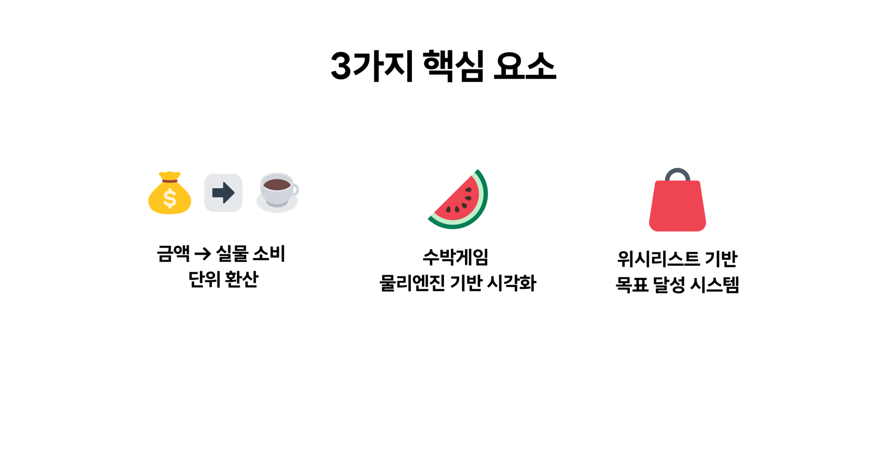
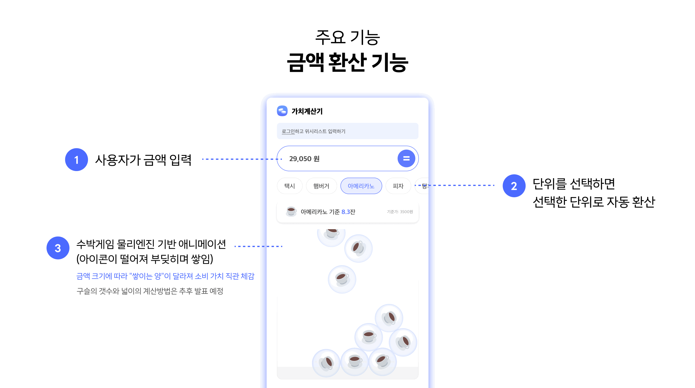
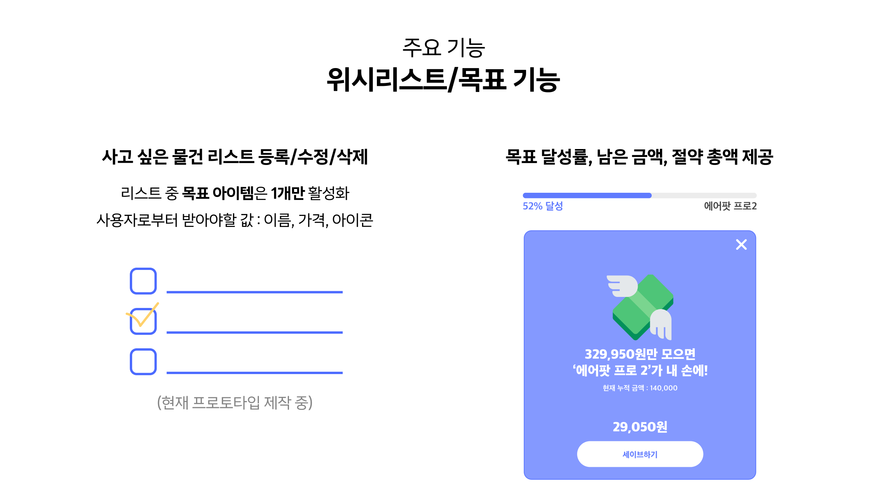
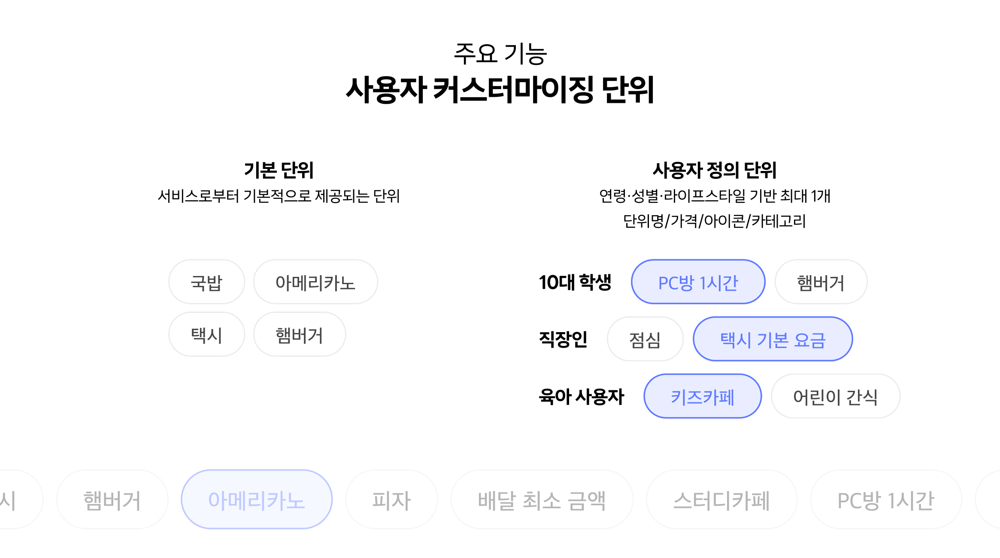
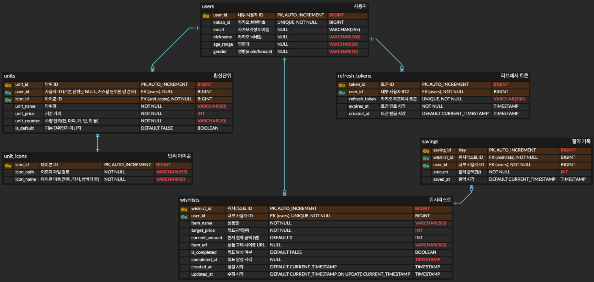

# 💰가치계산기 (Value Calculator)

> 금액을 나만의 단위로 환산하여 소비 가치를 재발견하는 서비스
> 
## 개발팀
<table width="100%">
  <tr>
    <td align="center" width="33.33%" valign="top">
      <a href="https://github.com/Hwangyerin">
        <br />
        <sub><b>황예린</b></sub>
      </a>
      <br /><br />
      
      
      <br />
      <div align="center" style="margin-top: 10px;">
        <b>기획/디자인</b>
      </div>
      <br />
      <a href="https://www.figma.com/design/qRRCKNhX4tLXvtiChWiBa6/%EA%B0%80%EC%B9%98%EA%B3%84%EC%82%B0%EA%B8%B0?node-id=430-8202&p=f&t=xu6So38601XfqQtR-0">
        
      </a>
    </td>
    <td align="center" width="33.33%" valign="top">
      <a href="https://github.com/uncledrew-sr">
        <br />
        <sub><b>최범규</b></sub>
      </a>
      <br /><br />
      
      
      <br />
      <div align="center" style="margin-top: 10px;">
        <b>프론트엔드</b>
      </div>
      <br />
      <a href="https://github.com/JNU-basic-web-value-calculator/value-calculator-fe">
        
      </a>
    </td>
    <td align="center" width="33.33%" valign="top">
      <a href="https://github.com/str-leshs">
        <br />
        <sub><b>이은서</b></sub>
      </a>
      <br /><br />
      
      
      <br />
      <div align="center" style="margin-top: 10px;">
        <b>백엔드</b>
      </div>
      <br />
      <a href="https://github.com/str-leshs/value-calculator">
        
      </a>
    </td>
  </tr>
</table>

## 목차

- [프로젝트 소개](#-프로젝트-소개)
- [기술 스택](#-기술-스택)
- [시스템 아키텍처](#-시스템-아키텍처)
- [API 명세서](#-api-명세서)
- [ERD](#-erd)
- [시작하기](#-시작하기)
- [배포](#-배포)
- [개발 컨벤션](#-개발-컨벤션)

## 프로젝트 소개
> **가치계산기**는 금액을 커피, 라면 등 일상적인 단위로 환산하여 소비의 가치를 직관적으로 이해할 수 있도록 돕는 서비스입니다.







## 기술 스택

### Backend
- **Framework**: Spring Boot 4.0.0
- **Language**: Java 21
- **Build Tool**: Gradle 9.2.0
- **ORM**: Spring Data JPA
- **Security**: Spring Security + JWT
- **API Documentation**: SpringDoc OpenAPI (Swagger)

### Database
- **RDBMS**: MySQL 8.0
- **Cloud**: AWS RDS

### Infrastructure
- **Container**: Docker
- **Cloud**: AWS EC2
- **CI/CD**: GitHub Actions
- **Version Control**: Git, GitHub

### External API
- **OAuth**: Kakao Login API

## 시스템 아키텍처


## API 문서

### Base URL
```
http://3.39.22.207:8080
```

### Swagger UI
```
http://3.39.22.207:8080/swagger-ui/index.html
```

### API 목록

| No | 도메인 | 기능 | HTTP | API 경로 | 인증 |
|----|--------|------|------|----------|------|
| 1 | User(Kakao) | 카카오 로그인 URL 조회 | GET | `/api/auth/kakao/login` | ❌ |
| 2 | User(Kakao) | 카카오 로그인 콜백 | GET | `/api/auth/kakao/callback` | ❌ |
| 3 | User(Kakao) | 토큰 갱신 | POST | `/api/auth/refresh` | ❌ |
| 4 | Unit | 기본 단위 목록 조회 | GET | `/api/units/default` | ❌ |
| 5 | Unit | 내 커스텀 단위 목록 조회 | GET | `/api/units/my` | ✅ |
| 6 | Unit | 모든 단위 조회 | GET | `/api/units/all` | ✅ |
| 7 | Unit | 커스텀 단위 생성 | POST | `/api/units` | ✅ |
| 8 | Unit | 커스텀 단위 수정 | PUT | `/api/units/{unitId}` | ✅ |
| 9 | Unit | 커스텀 단위 삭제 | DELETE | `/api/units/{unitId}` | ✅ |
| 10 | Unit | 아이콘 목록 조회 | GET | `/api/units/icons` | ❌ |
| 11 | Wishlist | 위시리스트 생성 | POST | `/api/wishlists` | ✅ |
| 12 | Wishlist | 진행 중 위시리스트 조회 | GET | `/api/wishlists/my/in-progress` | ✅ |
| 13 | Wishlist | 위시리스트 상세 조회 | GET | `/api/wishlists/{wishlistId}` | ✅ |
| 14 | Wishlist | 위시리스트 수정 | PUT | `/api/wishlists/{wishlistId}` | ✅ |
| 15 | Wishlist | 위시리스트 삭제 | DELETE | `/api/wishlists/{wishlistId}` | ✅ |
| 16 | Saving | 절약 기록 추가 | POST | `/api/savings` | ✅ |
| 17 | Saving | 절약 통계 조회 | GET | `/api/savings/statistics` | ✅ |
| 18 | Calculation | 가치 계산 | POST | `/api/calculate` | 🟡 |

> 🟡 표시는 선택적 인증 (로그인/비로그인 모두 사용 가능)

### 상세 API 문서
자세한 API 명세는 [API 명세서](./docs/API.md) 또는 [Swagger UI](http://3.39.22.207:8080/swagger-ui/index.html)를 참고하세요.

## ERD



## 시작하기

### 사전 요구사항
- Java 21
- Gradle 9.2.0
- MySQL 8.0
- Docker (선택사항)

### 로컬 개발 환경 설정

#### 1. 프로젝트 클론

```bash
git clone https://github.com/your-username/value-calculator-backend.git
cd value-calculator-backend
```

#### 2. 환경변수 설정

`src/main/resources/application-local.yml` 파일 생성:

```yaml
spring:
  datasource:
    url: jdbc:mysql://localhost:3306/value_calculator?useSSL=false&serverTimezone=Asia/Seoul
    username: your_db_username
    password: your_db_password
  
  jpa:
    hibernate:
      ddl-auto: update
    show-sql: true

kakao:
  client-id: your_kakao_client_id
  client-secret: your_kakao_client_secret
  redirect-uri: http://localhost:8080/api/auth/kakao/callback

jwt:
  secret: your_jwt_secret_key_min_256_bits
  access-token-validity: 3600000  # 1시간
  refresh-token-validity: 604800000  # 7일
```

#### 3. 데이터베이스 생성

```sql
CREATE DATABASE value_calculator CHARACTER SET utf8mb4 COLLATE utf8mb4_unicode_ci;
```

#### 4. 애플리케이션 실행

```bash
# Gradle로 실행
./gradlew bootRun --args='--spring.profiles.active=local'

# 또는 빌드 후 실행
./gradlew build
java -jar -Dspring.profiles.active=local build/libs/value-calculator-0.0.1-SNAPSHOT.jar
```

#### 5. API 테스트

브라우저에서 Swagger UI 접속:
```
http://localhost:8080/swagger-ui/index.html
```

## 배포

### AWS 배포 환경

- **EC2**: t2.micro (Spring Boot Application)
- **RDS**: MySQL 8.0 (Database)
- **Docker**: 컨테이너화된 애플리케이션


### 배포 프로세스

#### Phase 1: 로컬 개발
```
Local Development
├── Spring Boot (localhost:8080)
├── MySQL (localhost:3306)
└── 빠른 기능 구현 및 검증
```

#### Phase 2: AWS 마이그레이션
```
Production Environment
├── EC2: Spring Boot (Docker)
├── RDS: MySQL 8.0
└── GitHub Actions: CI/CD
```

## 개발 컨벤션

### Commit Convention

| Type       | 의미 |
|------------|------|
| `feat`     | 새로운 기능 추가 |
| `fix`      | 버그 수정 |
| `docs`     | 문서 수정 |
| `style`    | 코드 formatting, 세미콜론 누락, 코드 자체의 변경이 없는 경우 |
| `refactor` | 코드 리팩토링 |
| `chore`    | 패키지 매니저 수정, 그 외 기타 수정 |
| `rename`   | 파일 또는 폴더 명을 수정하거나 옮기는 작업만인 경우 |
| `hotfix`   | 급하게 치명적인 버그를 고쳐야 하는 경우 |
| `test`     | 테스트 코드, 리팩토링 테스트 코드 추가 |

**ex)**
```
feat: 카카오 로그인 API 구현
fix: JWT 토큰 갱신 오류 수정
docs: API 명세서 업데이트
```

### Git Branch 전략

```
main
  └── develop
       ├── feat
       └── fix
  └── hotfix
```

### Coding Convention

- **클래스명**: PascalCase
- **메서드/변수명**: camelCase
- **상수명**: UPPER_SNAKE_CASE
- **패키지명**: lowercase+ 언더스코어 사용
- **API 문서화**: 모든 Controller 메서드에 Swagger 어노테이션 필수
